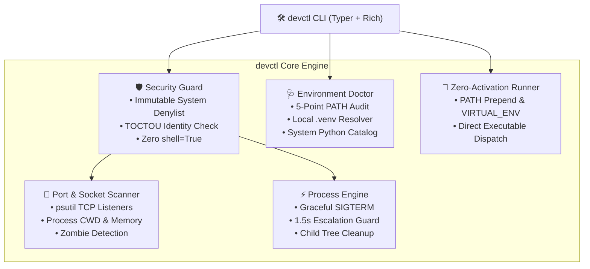

# 🛠️ devctl

<p align="center">
  <strong>The local dev runtime, port collision & Python environment guardian.</strong><br>
  Effortlessly inspect and free listening ports, hunt down zombie dev processes, diagnose Python PATH mismatches, and run commands inside local virtual environments with zero manual activation.
</p>

<p align="center">
  <a href="#-test-matrix--verification"></a>
  <a href="#-architecture"></a>
  <a href="#-security-threat-model--system-safety"></a>
  <a href="#-how-devctl-compares"></a>
  <a href="LICENSE"></a>
</p>

---

## ⚡ The Problems It Solves

Every developer deals with these three painful localhost frictions:

1. **The `EADDRINUSE` Port Collision**: A dev server crashes, but a lingering background process keeps port `3000`, `5173`, or `8000` locked. You are forced to memorize clunky OS commands (`netstat -ano | findstr :8000` and `taskkill /PID ... /F`).
2. **The "Laptop Fan Spun Up" Nightmare**: Dead terminals, IDE restarts, and crashed test runners leave orphaned `node.exe` or `python.exe` processes silently eating 80% CPU and 4 GB RAM in the background.
3. **The Python Environment Desync**: You run `pip install fastapi` in one terminal, but `python app.py` crashes with `ModuleNotFoundError` because your system `$PATH` points `pip` to Python 3.10 while your terminal executes MSYS2 or Python 3.13.

`devctl` is a lightweight, zero-configuration CLI designed to eliminate all three headaches with speed, safety, and clean terminal UI.

---

## 📊 How devctl Compares

| Feature | `netstat` / `taskkill` | `kill-port` (npm) | `fkill` (Node) | **`devctl`** |
| :--- | :---: | :---: | :---: | :---: |
| **Cross-Platform Port Scan** | ❌ Manual syntax per OS | ❌ Blind kill only | ⚠️ Interactive only | ✅ **Native Rich Table** |
| **Inspect Command & CWD** | ❌ PID only | ❌ None | ❌ Process name only | ✅ **Full Command & Folder** |
| **Memory & CPU Footprint** | ❌ Open Task Manager | ❌ None | ❌ None | ✅ **Live MB Display** |
| **Two-Stage Graceful Shutdown** | ❌ Instant force kill | ❌ Instant SIGKILL | ⚠️ SIGTERM | ✅ **SIGTERM -> 1.5s -> SIGKILL** |
| **System Process Safety Shield** | ❌ Can kill OS PIDs | ❌ None | ⚠️ Limited | ✅ **Immutable OS Denylist** |
| **TOCTOU PID Race Guard** | ❌ Recycled PID risk | ❌ Recycled PID risk | ❌ Recycled PID risk | ✅ **Timestamp Verification** |
| **Python / PATH Doctor** | ❌ None | ❌ None | ❌ None | ✅ **5-Point Parity Audit** |
| **Zero-Activation Runner** | ❌ None | ❌ None | ❌ None | ✅ **`devctl run <cmd>`** |

---

## 🏗️ Architecture



---

## 🚀 Quickstart & Interactive Tour (0 to 100)

Follow these step-by-step commands to experience every feature in under 2 minutes:

### 1. Installation
Clone and install `devctl` in editable mode:
```bash
git clone https://github.com/AryamanSharma14/-CLI-.git devctl
cd devctl
python -m pip install -e .
```

### 2. Verify Available Commands
```bash
devctl --help
```

### 3. Inspect Active Listening Ports & Running Servers
```bash
devctl ports
```
*Outputs a clean table with Port, Status, PID, Process name, Working directory, and Memory footprint.*

### 4. Run the 5-Point Python Environment Doctor
```bash
devctl doctor
```
*Instantly diagnoses if your terminal shell is running the correct Python, flags PATH desyncs between `pip` and `python`, and detects local `.venv` status.*

### 5. Catalog All Installed Python Runtimes
```bash
devctl py
```
*Displays every Python interpreter installed on your machine (Windows py launcher, MSYS2, Store, and venvs).*

### 6. Test Safe Port Freeing
In one terminal, start a temporary test server:
```bash
python -m http.server 8000
```
In another terminal, see it detected and free it safely:
```bash
# View the newly active port
devctl ports -p 8000

# Safely terminate it with prompt confirmation
devctl free 8000

# Or bypass confirmation in automation scripts
devctl free 8000 -y
```

### 7. Clean Lingering Zombie Dev Processes
```bash
devctl zombies
```
*Scans for orphaned background node/python/vite processes whose parent terminal died and frees stranded RAM.*

### 8. Run Commands in Local `.venv` Without Manual Activation
```bash
devctl run python -c "import sys; print('Running inside:', sys.executable)"
devctl run pytest tests -v
```

### 9. Safely Add a Package to `.venv`
```bash
devctl add requests
```
*Guarantees the package installs directly into the project's `.venv` and records it in `requirements.txt`.*

---

## 🛡️ Security Threat Model & System Safety

Because `devctl` interacts directly with OS networking, inspects system processes, and terminates PIDs, safety is guaranteed by design:

* **Immutable System Process Denylist**: Critical operating system components (`System` PID 4, `svchost.exe`, `lsass.exe`, `csrss.exe`, `explorer.exe`) are hardcoded and **can never be terminated**, preventing accidental system freezes or BSODs.
* **TOCTOU Race Condition Shield**: Before terminating any process, `devctl` checks `proc.create_time()` to verify the process currently holding the PID is the exact same process detected during the initial scan. If the PID was recycled by the OS, execution safely aborts.
* **Privileged Port Protection**: Ports `< 1024` require an explicit `--force` flag.
* **Zero `shell=True` Execution**: All command invocations use sanitized, tokenized argument arrays (`[executable, *args]`) to completely eliminate command injection risks.

---

## 🧪 Test Matrix & Verification

`devctl` includes a 100% passing automated test suite covering security, port detection, process termination, and Typer CLI commands:

```bash
pytest tests -v
```

```text
============================= test session starts =============================
platform win32 -- Python 3.13.5, pytest-9.1.1, pluggy-1.6.0
rootdir: C:\Users\aryam\Desktop\yee\coding\cli
configfile: pyproject.toml
plugins: anyio-4.10.0
collected 22 items

tests/test_cli.py::test_cli_help PASSED                                  [  4%]
tests/test_cli.py::test_cli_doctor PASSED                                [  9%]
tests/test_cli.py::test_cli_py PASSED                                    [ 13%]
tests/test_cli.py::test_cli_ports PASSED                                 [ 18%]
tests/test_cli.py::test_cli_ports_invalid_filter PASSED                  [ 22%]
tests/test_cli.py::test_cli_free_already_free_port PASSED                [ 27%]
tests/test_env.py::test_find_local_venv PASSED                           [ 31%]
tests/test_env.py::test_get_venv_python_executable PASSED                [ 36%]
tests/test_env.py::test_diagnose_environment PASSED                      [ 40%]
tests/test_env.py::test_discover_system_pythons PASSED                   [ 45%]
tests/test_ports.py::test_scan_listening_ports_returns_list PASSED       [ 50%]
tests/test_ports.py::test_mock_tcp_listener_detection PASSED             [ 54%]
tests/test_process.py::test_terminate_system_process_blocked PASSED      [ 59%]
tests/test_process.py::test_terminate_user_process_success PASSED        [ 63%]
tests/test_process.py::test_free_port_on_already_free_port PASSED        [ 68%]
tests/test_security.py::test_system_process_protection_by_pid PASSED     [ 72%]
tests/test_security.py::test_system_process_protection_by_name PASSED    [ 77%]
tests/test_security.py::test_dev_process_not_system PASSED               [ 81%]
tests/test_security.py::test_validate_port_valid PASSED                  [ 86%]
tests/test_security.py::test_validate_port_out_of_range PASSED           [ 90%]
tests/test_security.py::test_privileged_port PASSED                      [ 95%]
tests/test_security.py::test_toctou_process_identity PASSED              [100%]

============================= 22 passed in 1.32s ==============================
```

---

## 📄 License

MIT License. Designed and engineered by [Aryaman Sharma](https://github.com/AryamanSharma14).
