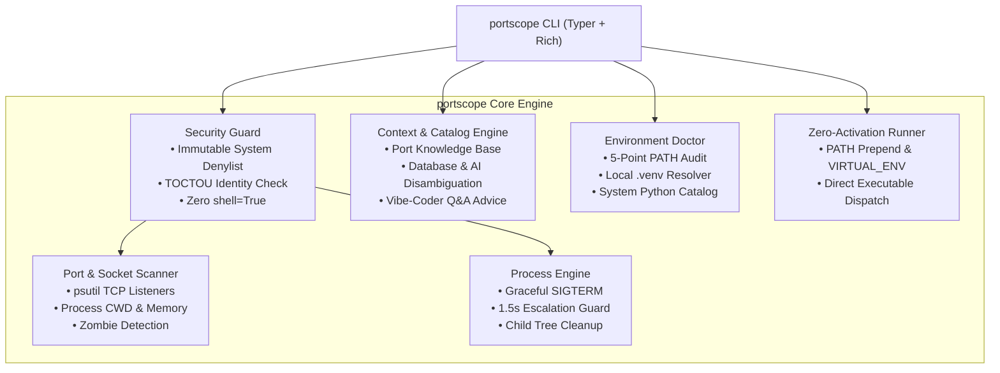

# portscope

<p align="center">
  <strong>The local dev runtime, port collision & Python environment guardian.</strong><br>
  Inspect and free listening ports with contextual intelligence, hunt down zombie dev processes, diagnose Python PATH mismatches, and manage AI/database runtimes with zero manual activation.
</p>

<p align="center">
  <a href="#-test-matrix--verification"></a>
  <a href="#-architecture"></a>
  <a href="#-security-threat-model--system-safety"></a>
  <a href="#-how-portscope-compares"></a>
  <a href="LICENSE"></a>
</p>

---

## The Problems It Solves

Every developer and AI engineer deals with these localhost frictions:

1. **Port Collisions & Cryptic Sockets**: A dev server crashes, but a lingering process keeps port `3000`, `5173`, or `8000` locked. You are forced to memorize clunky OS commands (`netstat -ano | findstr :8000` and `taskkill`).
2. **AI & Vector DB Ambiguity**: Port `8000` is shared by FastAPI, ChromaDB, and vLLM. Traditional tools only show `python.exe` without telling you *what* service is actually running or whether it is safe to kill.
3. **RAM Heavy Hitters & Orphaned Processes**: Dead terminal tabs, IDE restarts, and background bloat (Spotify, OneDrive) silently hold gigabytes of RAM in the background.
4. **Vibe Coder Friendly Explanations**: No robotic jargon. Plain English answers to the only questions that matter: *What is this? Is it useless bloat? Can I kill it? What breaks if I kill it?*
5. **Python Environment Desync**: You run `pip install` in one terminal, but `python app.py` crashes with `ModuleNotFoundError` because your system `$PATH` points `pip` to one Python while your terminal runs another.

`portscope` is a lightweight, zero-configuration CLI designed to eliminate these headaches with speed, safety, and a clean developer-native terminal interface.

---

## How portscope Compares

| Feature | `netstat` / `taskkill` | `kill-port` (npm) | `fkill` (Node) | **`portscope`** |
| :--- | :---: | :---: | :---: | :---: |
| **Contextual Purpose Classification** | [x] None | [x] None | [x] None | [x] **Database, AI, IDE, System** |
| **Noise-Filtered Port Scan** | [x] Manual syntax per OS | [x] Blind kill only | [!] Interactive only | [x] **`portscope ports` (hides IDE noise)** |
| **Vibe Coder Plain English Q&A** | [x] None | [x] None | [x] None | [x] **`portscope explain <port | PID | name>`** |
| **Smart System Summary** | [x] None | [x] None | [x] None | [x] **`portscope ports -s`** (`summary`) |
| **Heavy RAM / AI Process Hunter** | [x] Open Task Manager | [x] None | [x] None | [x] **`portscope ports --heavy`** (`heavy`) |
| **AI Stack Health Check** | [x] None | [x] None | [x] None | [x] **`portscope ports --ai`** (`ai`) |
| **AI Agent Context Snapshot** | [x] None | [x] None | [x] None | [x] **`portscope doctor -c`** (`ctx`) |
| **Zombie & Orphan Process Pruning** | [x] None | [x] None | [x] None | [x] **`portscope free -z`** (`zombies`) |
| **Two-Stage Graceful Shutdown** | [x] Instant force kill | [x] Instant SIGKILL | [!] SIGTERM | [x] **SIGTERM -> 1.5s -> SIGKILL** |
| **System Process Safety Shield** | [x] Can kill OS PIDs | [x] None | [!] Limited | [x] **Immutable OS Denylist** |
| **TOCTOU PID Race Guard** | [x] Recycled PID risk | [x] Recycled PID risk | [x] Recycled PID risk | [x] **Timestamp Verification** |
| **Python / PATH Doctor** | [x] None | [x] None | [x] None | [x] **`portscope doctor`** & **`-p`** |
| **Zero-Activation Runner** | [x] None | [x] None | [x] None | [x] **`portscope run <cmd>`** |

---

## Architecture



---

## Quickstart & Interactive Tour

### 1. Installation

```bash
git clone https://github.com/AryamanSharma14/-CLI-.git portscope
cd portscope
python -m pip install -e .
```

### 2. Available Commands Overview

```text
Usage: portscope [OPTIONS] COMMAND [ARGS]...

Commands:
  ports     Inspect active listening TCP ports with noise filtering & smart reclaim actions.
  explain   Analyze what a port, PID, or process does in plain English.
  free      Safely free ports, PIDs, or processes by name (or sweep dev servers with -d).
  doctor    Run 5-point environment health audit on local Python, virtualenv & system runtimes.
  run       Execute a command directly inside the local project .venv without manual activation.
  add       Safely install a Python package into the project's .venv and record in requirements.txt.
  mcp       Launch native Model Context Protocol (MCP) server over stdio for AI coding agents.
```

> [!TIP]
> **Minimalist by design**: Rather than cluttering your CLI with dozens of sprawling commands, `portscope` uses intuitive flags (`-d` to sweep dev servers, `-b` for bloat, `-z` for zombies, `-p` for Python versions, `-a` for all sockets, `--json` for automation). Legacy shortcuts (`portscope summary`, `portscope ai`, `portscope heavy`, `portscope zombies`, `portscope py`, `portscope ctx`) remain 100% backward compatible!

---

## Command Reference

### `portscope ports`
Scans all active TCP listening sockets, automatically hides internal IDE IPC noise, classifies each port, and highlights reclaimable background bloat:

```bash
# Default view (noise-filtered, hides 20+ internal IDE sockets)
portscope ports

# Show ONLY useless background bloat (Spotify, OneDrive) to reclaim RAM
portscope ports -b
# or --bloat

# Show all sockets including internal editor IPC
portscope ports -a
# or --all

# Executive system port & RAM summary
portscope ports -s
# or portscope summary

# Rank heaviest dev and AI processes by memory
portscope ports --heavy
# or portscope heavy

# AI stack health check (Ollama, ChromaDB, vLLM, Gradio)
portscope ports --ai
# or portscope ai

# Machine-readable JSON array output
portscope ports --json
```

```text
                                   Active Listening Ports & Runtime Processes                                   
╭────────┬──────────┬─────────────┬────────┬────────────────────┬───────────────────────────────────┬──────────╮
│   PORT │  STATUS  │  CATEGORY   │    PID │ PROCESS            │ PURPOSE / CONTEXT                 │      RAM │
├────────┼──────────┼─────────────┼────────┼────────────────────┼───────────────────────────────────┼──────────┤
│    135 │  SYSTEM  │   SYSTEM    │   2024 │ svchost.exe        │ Windows RPC Endpoint Mapper       │  21.6 MB │
│    139 │  SYSTEM  │   SYSTEM    │      4 │ System             │ NetBIOS Session Service           │   9.8 MB │
│    445 │  SYSTEM  │   SYSTEM    │      4 │ System             │ SMB Direct Host / File Sharing    │   9.8 MB │
│   3306 │  ACTIVE  │  DATABASE   │   7368 │ mysqld.exe         │ MySQL Database Server             │  69.3 MB │
│   5040 │  SYSTEM  │   SYSTEM    │  10556 │ svchost.exe        │ Windows Connected Devices Service │  25.4 MB │
│   5432 │  ACTIVE  │  DATABASE   │   8596 │ postgres.exe       │ PostgreSQL Database Server        │  24.4 MB │
│   7768 │  BLOAT   │ BACKGROUND  │  34336 │ Spotify.exe        │ Spotify Local Web Helper          │ 254.1 MB │
│  33060 │  ACTIVE  │  DATABASE   │   7368 │ mysqld.exe         │ MySQL X Protocol                  │  69.3 MB │
│  42050 │  BLOAT   │ BACKGROUND  │   7564 │ OneDrive.Sync.Ser… │ OneDrive Cloud Sync Daemon        │  39.1 MB │
│  57621 │  BLOAT   │ BACKGROUND  │  34336 │ Spotify.exe        │ Spotify Connect Discovery         │ 254.1 MB │
│  58768 │  BLOAT   │ BACKGROUND  │  19964 │ SpotifyLauncher.e… │ Spotify Launcher Helper           │  45.4 MB │
│  59465 │  ACTIVE  │   REMOTE    │  34304 │ ssh.exe            │ SSH Tunnel / Remote Session       │  15.6 MB │
╰────────┴──────────┴─────────────┴────────┴────────────────────┴───────────────────────────────────┴──────────╯
  + 26 internal IDE socket(s) hidden · use `portscope ports -a` to view all
  Reclaimable: ~593 MB RAM in background bloat · Run `portscope free spotify` to reclaim
  Showing 12 socket(s) · Run `portscope explain <target>` for plain-English advice
```

---

### `portscope explain <target>`
Plain English, vibe-coder friendly explanation card answering:
- **What is this?**
- **Is it useless bloat or mandatory?**
- **Can I kill it?**
- **What happens if I kill it?**
- **Exact command to run**

Works interchangeably with a **Port number** (`3000`), a **Process ID / PID** (`34336`), or a **Process Name** (`spotify`, `antigravity`, `postgres`):

```bash
# By Port
portscope explain 7768

# By PID
portscope explain 34336

# By Name
portscope explain spotify
portscope explain antigravity

# Machine-readable JSON output
portscope explain 7768 --json
```

```text
╭────────────────────────────────────────── portscope explain · Port 7768 ───────────────────────────────────────────╮
│   TARGET         : Port 7768  ·  Spotify.exe (PID 34336)                                                        │
│   ROLE           : USELESS BACKGROUND BLOAT  ·  BACKGROUND                                                      │
│   RAM CONSUMED   : 254.1 MB                                                                                     │
│   WORKING DIR    : C:\Program Files\WindowsApps\SpotifyAB.SpotifyMusic_1.301.234.0_x64__zpdnekdrzrea0           │
│   COMMAND        : Spotify.exe                                                                                  │
│                                                                                                                 │
│ ────────────────────────────────────────────────────────────────────────                                        │
│ WHAT IS THIS?                                                                                                   │
│   Spotify background helper that allows browser web players to control desktop playback.                        │
│   Technical description: Spotify Local Web Helper                                                               │
│                                                                                                                 │
│ CAN I KILL IT?                                                                                                  │
│   [YES - 100% SAFE TO KILL]                                                                                     │
│   Completely safe to terminate. Zero negative impact on your coding workspace.                                  │
│                                                                                                                 │
│ WHAT HAPPENS IF I KILL IT?                                                                                      │
│   Zero impact on coding! Music might pause. Frees over 250 MB of RAM immediately.                               │
│                                                                                                                 │
│ ACTION & COMMAND:                                                                                               │
│   `portscope free 7768`                                                                                            │
╰─────────────────────────────────────────────────────────────────────────────────────────────────────────────────╯
```

---

### `portscope free <targets...>`
Safely frees one or more ports, PIDs, or processes by name using two-stage termination (SIGTERM -> 1.5s -> SIGKILL).

* **Interactive Keystroke Picker**: Simply run `portscope free` without arguments in an interactive terminal to choose targets with a single keystroke.
* **"Start Fresh" Dev Sweeper (`-d` / `--dev`)**: Sweeps and terminates all hung Node, Vite, Next.js, Uvicorn, and Flask dev servers holding ports, while strictly protecting databases and code editors.
* **Zombie Hunter (`-z` / `--zombies`)**: Scans and prunes orphaned background dev processes.

```bash
# Interactive numbered keystroke picker (run with zero args)
portscope free

# "Start Fresh" dev server sweeper (kills lingering Node/Python dev servers)
portscope free --dev
portscope free -d -y   # bypass confirmation

# Free a port
portscope free 8000

# Free multiple ports without confirmation prompt
portscope free 3000 8000 -y

# Free by process name (finds all instances and reclaims RAM)
portscope free spotify

# Free by PID
portscope free 34336

# Scan & prune lingering/orphaned development processes
portscope free -z
# or portscope free --zombies (or legacy `portscope zombies`)
```

---

### `portscope doctor`
Audits your active Python interpreter against `.venv` and flags PATH mismatches between `pip` and `python`.

Supports installed runtime cataloging (`-p` / `--py`), AI context generation (`-c` / `--ctx`), and JSON output (`--json`):

```bash
# Run 5-point environment health audit
portscope doctor

# Catalog all Python runtimes installed across your machine
portscope doctor -p
# or portscope doctor --py (or legacy `portscope py`)

# Generate clean markdown context snapshot for AI coding agents
portscope doctor -c
# or portscope doctor --ctx (or legacy `portscope ctx`)

# Output machine-readable JSON report
portscope doctor --json
```

```text
                                         Installed Python Runtimes Catalog                                         
╭────────────────┬────────────┬────────────────────────┬──────────────────────────────────────────────────────────╮
│ TAG            │ VERSION    │ SOURCE                 │ EXECUTABLE PATH                                          │
├────────────────┼────────────┼────────────────────────┼──────────────────────────────────────────────────────────┤
│ * 3.13         │ 3.13       │ Windows py launcher    │ C:\Users\developer\AppData\Local\Programs\Python313\…    │
│   3.10         │ 3.10       │ Windows py launcher    │ C:\Users\developer\AppData\Local\Programs\Python310\…    │
│   msys         │ 3.13.5     │ MSYS2 MinGW            │ C:\msys64\mingw64\bin\python.exe                         │
│   msys         │ 3.13.5     │ MSYS2 MinGW            │ C:\msys64\mingw64\bin\python3.exe                        │
│   project-venv │ 3.13.5     │ Project (.venv)        │ C:\Users\developer\projects\my-app\.venv\Scripts\pyt…    │
╰────────────────┴────────────┴────────────────────────┴──────────────────────────────────────────────────────────╯
```

---

### `portscope run <cmd>`
Runs any command directly inside the project's `.venv` without manual shell activation.

Includes **Pre-Flight Port Clearing (`-f` / `--free-port`)** to prevent the `EADDRINUSE` crash loop before starting your server:

```bash
# Pre-flight: Clear port 3000 if occupied, then launch dev server
portscope run --free-port 3000 npm run dev
portscope run -f 8000 uvicorn main:app --reload

# Standard zero-activation runner
portscope run pytest tests -v
```

---

### `portscope add <package>`
Safely installs a Python package into the project's `.venv` using the matching `python -m pip` binary and records it in `requirements.txt`:

```bash
portscope add fastapi uvicorn
```

---

### `portscope mcp`
Launches a native **Model Context Protocol (MCP)** server over standard I/O (JSON-RPC 2.0).

Allows AI coding assistants (such as **Cursor**, **Claude Desktop**, and **Antigravity**) to autonomously inspect listening ports, diagnose localhost collisions, and safely free stuck development servers.

```bash
portscope mcp
```

#### Configuration for Cursor (`.cursor/mcp.json`):
```json
{
  "mcpServers": {
    "portscope": {
      "command": "portscope",
      "args": ["mcp"]
    }
  }
}
```

#### Configuration for Claude Desktop (`claude_desktop_config.json`):
```json
{
  "mcpServers": {
    "portscope": {
      "command": "portscope",
      "args": ["mcp"]
    }
  }
}
```

---

## Security Threat Model & System Safety

* **Immutable System Process Denylist**: Critical operating system components (`System` PID 4, `svchost.exe`, `lsass.exe`, `csrss.exe`, `explorer.exe`) are hardcoded and **can never be terminated**, preventing accidental system freezes or BSODs.
* **TOCTOU Race Condition Shield**: Checks process creation timestamps (`proc.create_time()`) right before termination to ensure the PID was not recycled to an innocent app.
* **Privileged Port Protection**: Ports `< 1024` require an explicit `--force` flag.
* **Zero `shell=True` Execution**: All command invocations use sanitized, tokenized argument arrays (`[executable, *args]`) to completely eliminate command injection risks.

---

## Test Matrix & Verification

`portscope` includes a 100% passing automated test suite covering security, contextual catalog lookups, port detection, process termination, noise filtering, and Typer CLI commands:

```bash
pytest tests -v
```

```text
============================= test session starts =============================
platform win32 -- Python 3.13.5, pytest-9.1.1, pluggy-1.6.0
rootdir: C:\Users\developer\projects\my-app
configfile: pyproject.toml
plugins: anyio-4.10.0
collected 51 items

tests/test_catalog.py::test_lookup_system_port PASSED                    [  1%]
tests/test_catalog.py::test_lookup_database_port PASSED                  [  3%]
tests/test_catalog.py::test_lookup_ai_ollama_port PASSED                 [  5%]
tests/test_catalog.py::test_lookup_disambiguation_port_8000 PASSED       [  7%]
tests/test_catalog.py::test_lookup_ide_process PASSED                    [  9%]
tests/test_catalog.py::test_lookup_safe_to_kill_background PASSED        [ 11%]
tests/test_catalog.py::test_vibe_coder_explanation_fields PASSED         [ 13%]
tests/test_cli.py::test_cli_help PASSED                                  [ 15%]
tests/test_cli.py::test_cli_doctor PASSED                                [ 17%]
tests/test_cli.py::test_cli_py PASSED                                    [ 19%]
tests/test_cli.py::test_cli_ports PASSED                                 [ 21%]
tests/test_cli.py::test_cli_explain PASSED                               [ 23%]
tests/test_cli.py::test_cli_heavy PASSED                                 [ 25%]
tests/test_cli.py::test_cli_ai PASSED                                    [ 27%]
tests/test_cli.py::test_cli_ctx PASSED                                   [ 29%]
tests/test_cli.py::test_cli_ports_invalid_filter PASSED                  [ 31%]
tests/test_cli.py::test_cli_free_already_free_port PASSED                [ 33%]
tests/test_cli.py::test_cli_explain_process_name PASSED                  [ 35%]
tests/test_cli.py::test_cli_explain_pid PASSED                           [ 37%]
tests/test_cli.py::test_cli_summary PASSED                               [ 39%]
tests/test_cli.py::test_cli_ports_bloat_flag PASSED                      [ 41%]
tests/test_cli.py::test_cli_doctor_py_flag PASSED                        [ 43%]
tests/test_cli.py::test_cli_free_zombies_flag PASSED                     [ 45%]
tests/test_cli.py::test_cli_ports_json_flag PASSED                       [ 47%]
tests/test_cli.py::test_cli_explain_json_flag PASSED                     [ 49%]
tests/test_cli.py::test_cli_doctor_json_flag PASSED                      [ 50%]
tests/test_cli.py::test_cli_free_dev_flag PASSED                         [ 52%]
tests/test_cli.py::test_cli_run_free_port_flag PASSED                    [ 54%]
tests/test_env.py::test_find_local_venv PASSED                           [ 56%]
tests/test_env.py::test_get_venv_python_executable PASSED                [ 58%]
tests/test_env.py::test_diagnose_environment PASSED                      [ 60%]
tests/test_env.py::test_discover_system_pythons PASSED                   [ 62%]
tests/test_mcp.py::test_mcp_tools_spec PASSED                            [ 64%]
tests/test_mcp.py::test_mcp_call_list_ports PASSED                       [ 66%]
tests/test_mcp.py::test_mcp_call_explain_target PASSED                   [ 68%]
tests/test_mcp.py::test_mcp_call_explain_invalid PASSED                  [ 70%]
tests/test_mcp.py::test_mcp_call_doctor PASSED                           [ 72%]
tests/test_mcp.py::test_mcp_call_free_dev_servers PASSED                 [ 74%]
tests/test_mcp.py::test_mcp_call_free_system_protection PASSED           [ 76%]
tests/test_ports.py::test_scan_listening_ports_returns_list PASSED       [ 78%]
tests/test_ports.py::test_mock_tcp_listener_detection PASSED             [ 80%]
tests/test_process.py::test_terminate_system_process_blocked PASSED      [ 82%]
tests/test_process.py::test_terminate_user_process_success PASSED        [ 84%]
tests/test_process.py::test_free_port_on_already_free_port PASSED        [ 86%]
tests/test_security.py::test_system_process_protection_by_pid PASSED     [ 88%]
tests/test_security.py::test_system_process_protection_by_name PASSED    [ 90%]
tests/test_security.py::test_dev_process_not_system PASSED               [ 92%]
tests/test_security.py::test_validate_port_valid PASSED                  [ 94%]
tests/test_security.py::test_validate_port_out_of_range PASSED           [ 96%]
tests/test_security.py::test_privileged_port PASSED                      [ 98%]
tests/test_security.py::test_toctou_process_identity PASSED              [100%]

============================= 51 passed in 12.24s =============================
```

---

## License

MIT License. Designed and engineered by [Aryaman Sharma](https://github.com/AryamanSharma14).
