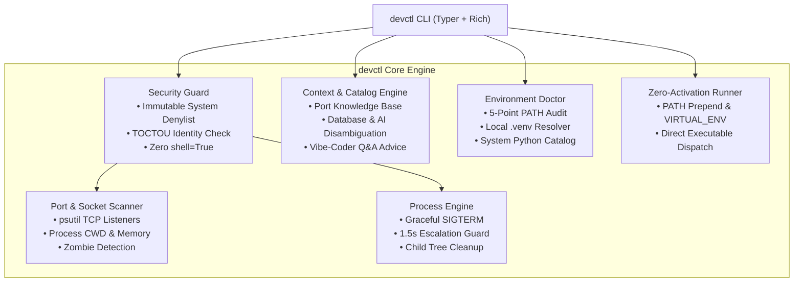

# devctl

<p align="center">
  <strong>The local dev runtime, port collision & Python environment guardian.</strong><br>
  Inspect and free listening ports with contextual intelligence, hunt down zombie dev processes, diagnose Python PATH mismatches, and manage AI/database runtimes with zero manual activation.
</p>

<p align="center">
  <a href="#-test-matrix--verification"></a>
  <a href="#-architecture"></a>
  <a href="#-security-threat-model--system-safety"></a>
  <a href="#-how-devctl-compares"></a>
  <a href="LICENSE"></a>
</p>

---

## The Problems It Solves

Every developer and AI engineer deals with these localhost frictions:

1. **Port Collisions & Cryptic Sockets**: A dev server crashes, but a lingering process keeps port `3000`, `5173`, or `8000` locked. You are forced to memorize clunky OS commands (`netstat -ano | findstr :8000` and `taskkill`).
2. **AI & Vector DB Ambiguity**: Port `8000` is shared by FastAPI, ChromaDB, and vLLM. Traditional tools only show `python.exe` without telling you *what* service is actually running or whether it is safe to kill.
3. **RAM Heavy Hitters & Orphaned Processes**: Dead terminal tabs, IDE restarts, and background bloat (Spotify, OneDrive) silently hold gigabytes of RAM in the background.
4. **Vibe Coder Friendly Explanations**: No robotic jargon. Plain English answers to the only questions that matter: *What is this? Is it useless bloat? Can I kill it? What breaks if I kill it?*
5. **Python Environment Desync**: You run `pip install` in one terminal, but `python app.py` crashes with `ModuleNotFoundError` because your system `$PATH` points `pip` to one Python while your terminal runs another.

`devctl` is a lightweight, zero-configuration CLI designed to eliminate these headaches with speed, safety, and a clean developer-native terminal interface.

---

## How devctl Compares

| Feature | `netstat` / `taskkill` | `kill-port` (npm) | `fkill` (Node) | **`devctl`** |
| :--- | :---: | :---: | :---: | :---: |
| **Contextual Purpose Classification** | [x] None | [x] None | [x] None | [x] **Database, AI, IDE, System** |
| **Cross-Platform Port Scan** | [x] Manual syntax per OS | [x] Blind kill only | [!] Interactive only | [x] **Native Rich Table + Smart Suggestions** |
| **Vibe Coder Plain English Q&A** | [x] None | [x] None | [x] None | [x] **`devctl explain <port | PID | name>`** |
| **Smart System Summary** | [x] None | [x] None | [x] None | [x] **`devctl summary`** |
| **Heavy RAM / AI Process Hunter** | [x] Open Task Manager | [x] None | [x] None | [x] **`devctl heavy`** |
| **AI Stack Health Check** | [x] None | [x] None | [x] None | [x] **`devctl ai`** |
| **AI Agent Context Snapshot** | [x] None | [x] None | [x] None | [x] **`devctl ctx`** |
| **Two-Stage Graceful Shutdown** | [x] Instant force kill | [x] Instant SIGKILL | [!] SIGTERM | [x] **SIGTERM -> 1.5s -> SIGKILL** |
| **System Process Safety Shield** | [x] Can kill OS PIDs | [x] None | [!] Limited | [x] **Immutable OS Denylist** |
| **TOCTOU PID Race Guard** | [x] Recycled PID risk | [x] Recycled PID risk | [x] Recycled PID risk | [x] **Timestamp Verification** |
| **Python / PATH Doctor** | [x] None | [x] None | [x] None | [x] **5-Point Parity Audit** |
| **Zero-Activation Runner** | [x] None | [x] None | [x] None | [x] **`devctl run <cmd>`** |

---

## Architecture



---

## Quickstart & Interactive Tour

### 1. Installation

```bash
git clone https://github.com/AryamanSharma14/-CLI-.git devctl
cd devctl
python -m pip install -e .
```

### 2. Available Commands Overview

```text
Usage: devctl [OPTIONS] COMMAND [ARGS]...

Commands:
  ports     Inspect active listening TCP ports with smart action suggestions.
  summary   Executive summary of RAM usage, active dev servers, and safe-to-kill bloat.
  explain   Analyze what a port, PID, or process does in plain English.
  free      Safely free ports, PIDs, or processes by name.
  zombies   Scan and prune lingering/orphaned development processes.
  heavy     Scan and rank the heaviest development and AI processes by RAM usage.
  ai        Status check for local AI stack (Ollama, Vector DBs, Gradio, Streamlit).
  ctx       Generate clean markdown context snapshot for AI coding agents.
  doctor    Run 5-point environment health audit on local Python and virtualenv.
  py        Catalog all Python runtimes installed across your machine.
  run       Execute a command directly inside the local project .venv without activation.
  add       Safely install a Python package into the project's .venv and record in requirements.txt.
```

---

## Command Reference

### `devctl ports`
Scans all active TCP listening sockets, classifies them into functional categories, and automatically suggests which ports are safe to kill to reclaim RAM.

```bash
devctl ports
```

```text
                                Active Listening Ports & Runtime Processes
╭────────┬──────────┬─────────────┬────────┬────────────────────┬────────────────────────────────────┬──────────╮
│   PORT │  STATUS  │  CATEGORY   │    PID │ PROCESS            │ PURPOSE / CONTEXT                  │      RAM │
├────────┼──────────┼─────────────┼────────┼────────────────────┼────────────────────────────────────┼──────────┤
│    135 │  SYSTEM  │   SYSTEM    │   2024 │ svchost.exe        │ Windows RPC Endpoint Mapper        │  21.8 MB │
│   3306 │  ACTIVE  │  DATABASE   │   7368 │ mysqld.exe         │ MySQL Database Server              │  69.3 MB │
│   5432 │  ACTIVE  │  DATABASE   │   8596 │ postgres.exe       │ PostgreSQL Database Server         │  24.4 MB │
│   7768 │  ACTIVE  │ BACKGROUND  │  34336 │ Spotify.exe        │ Spotify Local Web Helper           │ 245.5 MB │
│  11434 │  ACTIVE  │   AI/LLM    │   1420 │ ollama.exe         │ Ollama Local LLM Inference         │ 184.2 MB │
│  50917 │  ACTIVE  │   IDE/LSP   │  30828 │ Antigravity IDE.e… │ Antigravity Code Editor Window     │ 235.8 MB │
╰────────┴──────────┴─────────────┴────────┴────────────────────┴────────────────────────────────────┴──────────╯

╭────────────────────────────────────────── devctl · Action Suggestions ──────────────────────────────────────────╮
│ SMART PORT INTELLIGENCE & RECLAIM OPPORTUNITIES                                                                 │
│                                                                                                                 │
│ • USELESS BACKGROUND BLOAT (Safe to terminate · Free ~246 MB RAM):                                              │
│   • Port 7768 · Spotify.exe (PID 34336) · 245.5 MB  -->  Run: `devctl free 7768`                                │
│                                                                                                                 │
│ • LOCAL DATABASES & AI MODELS (Keep running if app connects):                                                   │
│   • Port 3306 · mysqld.exe (PID 7368) · MySQL Database Server                                                   │
│   • Port 5432 · postgres.exe (PID 8596) · PostgreSQL Database Server                                            │
│                                                                                                                 │
│ • ACTIVE CODING TOOLS & IDES (Keep running · Never terminate while coding):                                     │
│   • Port 50917 · Antigravity IDE.exe (PID 30828) · Active editor window                                         │
╰─────────────────────────────────────────────────────────────────────────────────────────────────────────────────╯
```

---

### `devctl summary`
Instant executive summary of system port health, memory reclaim targets, active dev servers, and active editors.

```bash
devctl summary
```

---

### `devctl explain <target>`
Plain English, vibe-coder friendly explanation card answering:
- **What is this?**
- **Is it useless bloat or mandatory?**
- **Can I kill it?**
- **What happens if I kill it?**
- **Exact command to run**

Works interchangeably with a **Port number** (`3000`), a **Process ID / PID** (`30828`), or a **Process Name** (`spotify`, `antigravity`, `postgres`):

```bash
# By Port
devctl explain 7768

# By PID (e.g. from table or Task Manager)
devctl explain 30828

# By Name
devctl explain spotify
devctl explain antigravity
```

```text
╭────────────────────────────────────────── devctl explain · Port 7768 ───────────────────────────────────────────╮
│   TARGET         : Port 7768  ·  Spotify.exe (PID 34336)                                                        │
│   ROLE           : USELESS BACKGROUND BLOAT  ·  BACKGROUND                                                      │
│   RAM CONSUMED   : 245.5 MB                                                                                     │
│   WORKING DIR    : C:\Program Files\WindowsApps\SpotifyAB.SpotifyMusic_1.301.234.0_x64__zpdnekdrzrea0           │
│   COMMAND        : Spotify.exe                                                                                  │
│                                                                                                                 │
│ ────────────────────────────────────────────────────────────────────────                                        │
│ WHAT IS THIS?                                                                                                   │
│   Spotify background helper that allows browser web players to control desktop playback.                        │
│   Technical description: Spotify Local Web Helper                                                               │
│                                                                                                                 │
│ CAN I KILL IT?                                                                                                  │
│   [YES - 100% SAFE TO KILL]                                                                                     │
│   Completely safe to terminate. Zero negative impact on your coding workspace.                                  │
│                                                                                                                 │
│ WHAT HAPPENS IF I KILL IT?                                                                                      │
│   Zero impact on coding! Music might pause. Frees over 250 MB of RAM immediately.                               │
│                                                                                                                 │
│ ACTION & COMMAND:                                                                                               │
│   `devctl free 7768`                                                                                            │
╰─────────────────────────────────────────────────────────────────────────────────────────────────────────────────╯
```

---

### `devctl free <targets...>`
Safely frees one or more ports, PIDs, or processes by name using two-stage termination (SIGTERM -> 1.5s -> SIGKILL):

```bash
# Free a port
devctl free 8000

# Free multiple ports
devctl free 3000 8000 -y

# Free by process name (finds all instances and reclaims RAM)
devctl free spotify

# Free by PID
devctl free 34336
```

---

### `devctl doctor`
Audits your active Python interpreter against `.venv` and flags PATH mismatches between `pip` and `python`:

```bash
devctl doctor
```

---

### `devctl run <cmd>`
Runs any command directly inside the project's `.venv` without manual shell activation:

```bash
devctl run pytest tests -v
devctl run uvicorn main:app --reload
```

---

## Security Threat Model & System Safety

* **Immutable System Process Denylist**: Critical operating system components (`System` PID 4, `svchost.exe`, `lsass.exe`, `csrss.exe`, `explorer.exe`) are hardcoded and **can never be terminated**, preventing accidental system freezes or BSODs.
* **TOCTOU Race Condition Shield**: Checks process creation timestamps (`proc.create_time()`) right before termination to ensure the PID was not recycled to an innocent app.
* **Privileged Port Protection**: Ports `< 1024` require an explicit `--force` flag.
* **Zero `shell=True` Execution**: All command invocations use sanitized, tokenized argument arrays (`[executable, *args]`) to completely eliminate command injection risks.

---

## Test Matrix & Verification

`devctl` includes a 100% passing automated test suite covering security, contextual catalog lookups, port detection, process termination, and Typer CLI commands:

```bash
pytest tests -v
```

```text
============================= test session starts =============================
platform win32 -- Python 3.13.5, pytest-9.1.1, pluggy-1.6.0
rootdir: C:\Users\aryam\Desktop\yee\coding\cli
configfile: pyproject.toml
plugins: anyio-4.10.0
collected 36 items

tests/test_catalog.py::test_lookup_system_port PASSED                    [  2%]
tests/test_catalog.py::test_lookup_database_port PASSED                  [  5%]
tests/test_catalog.py::test_lookup_ai_ollama_port PASSED                 [  8%]
tests/test_catalog.py::test_lookup_disambiguation_port_8000 PASSED       [ 11%]
tests/test_catalog.py::test_lookup_ide_process PASSED                    [ 13%]
tests/test_catalog.py::test_lookup_safe_to_kill_background PASSED        [ 16%]
tests/test_catalog.py::test_vibe_coder_explanation_fields PASSED         [ 19%]
tests/test_cli.py::test_cli_help PASSED                                  [ 22%]
tests/test_cli.py::test_cli_doctor PASSED                                [ 25%]
tests/test_cli.py::test_cli_py PASSED                                    [ 27%]
tests/test_cli.py::test_cli_ports PASSED                                 [ 30%]
tests/test_cli.py::test_cli_explain PASSED                               [ 33%]
tests/test_cli.py::test_cli_heavy PASSED                                 [ 36%]
tests/test_cli.py::test_cli_ai PASSED                                    [ 38%]
tests/test_cli.py::test_cli_ctx PASSED                                   [ 41%]
tests/test_cli.py::test_cli_ports_invalid_filter PASSED                  [ 44%]
tests/test_cli.py::test_cli_free_already_free_port PASSED                [ 47%]
tests/test_cli.py::test_cli_explain_process_name PASSED                  [ 50%]
tests/test_cli.py::test_cli_explain_pid PASSED                           [ 52%]
tests/test_cli.py::test_cli_summary PASSED                               [ 55%]
tests/test_env.py::test_find_local_venv PASSED                           [ 58%]
tests/test_env.py::test_get_venv_python_executable PASSED                [ 61%]
tests/test_env.py::test_diagnose_environment PASSED                      [ 63%]
tests/test_env.py::test_discover_system_pythons PASSED                   [ 66%]
tests/test_ports.py::test_scan_listening_ports_returns_list PASSED       [ 69%]
tests/test_ports.py::test_mock_tcp_listener_detection PASSED             [ 72%]
tests/test_process.py::test_terminate_system_process_blocked PASSED      [ 75%]
tests/test_process.py::test_terminate_user_process_success PASSED        [ 77%]
tests/test_process.py::test_free_port_on_already_free_port PASSED        [ 80%]
tests/test_security.py::test_system_process_protection_by_pid PASSED     [ 83%]
tests/test_security.py::test_system_process_protection_by_name PASSED    [ 86%]
tests/test_security.py::test_dev_process_not_system PASSED               [ 88%]
tests/test_security.py::test_validate_port_valid PASSED                  [ 91%]
tests/test_security.py::test_validate_port_out_of_range PASSED           [ 94%]
tests/test_security.py::test_privileged_port PASSED                      [ 97%]
tests/test_security.py::test_toctou_process_identity PASSED              [100%]

============================= 36 passed in 3.64s ==============================
```

---

## License

MIT License. Designed and engineered by [Aryaman Sharma](https://github.com/AryamanSharma14).
